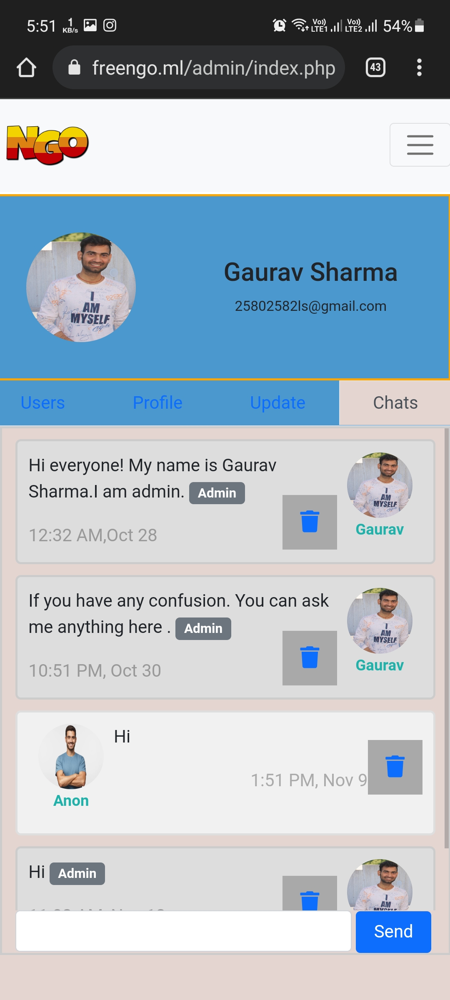

# NGO PROJECT

This project is like ngo websites where you can donate to people your status will show to people whoever will visit website.
Here for people chat system has created for support or discussion like forum .
And a seperate user panel for showing status of profile.

https://freengo.ml

## Tech Stack

**Client:** HTML, CSS, BOOTSTRAP, JAVASCRIPT, JQUERY, AJAX

**Server:** PHP, MYSQL

### Desktop view

 
 

 

### Mobile view

 
 

 
 

 

## Support

For support, email gauravsharma9339@gmail.com
